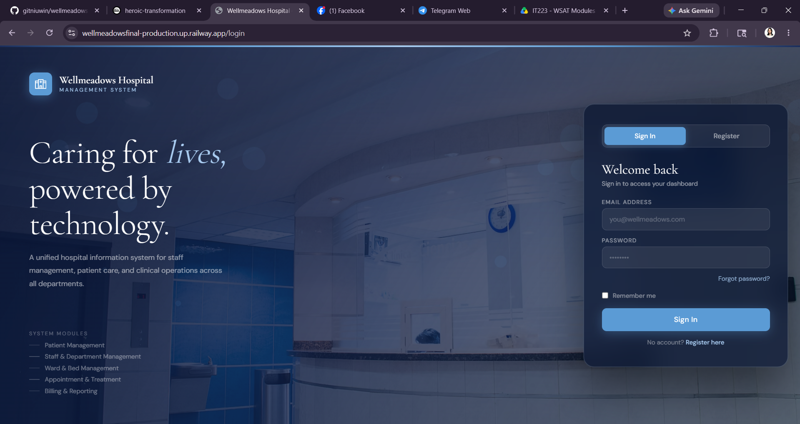
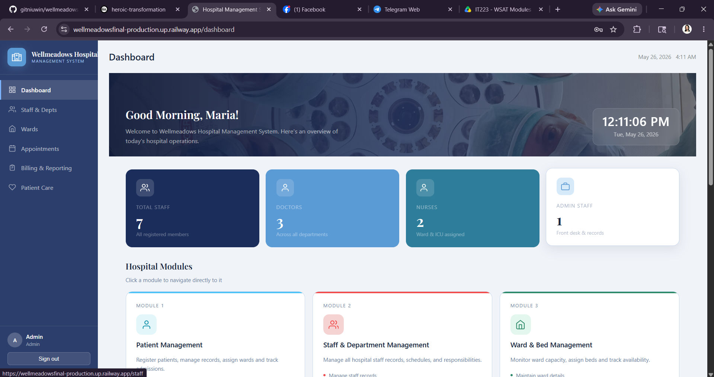
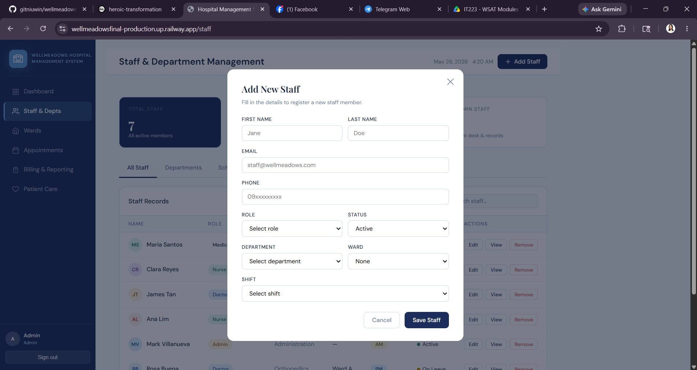
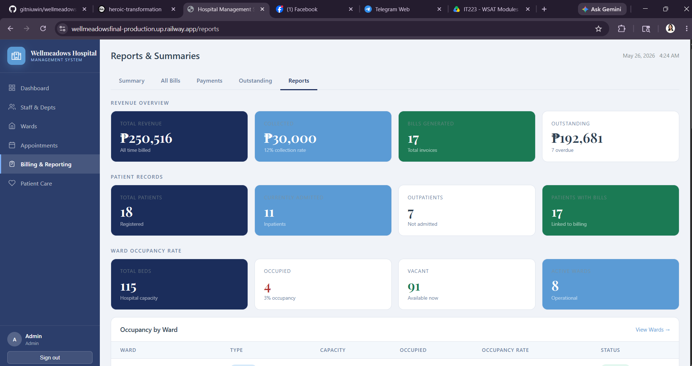
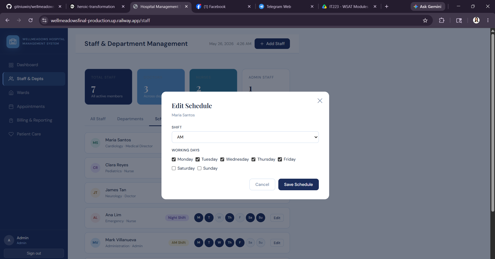
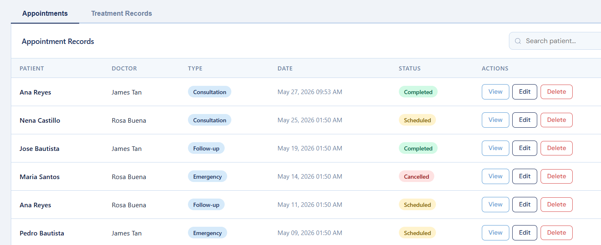
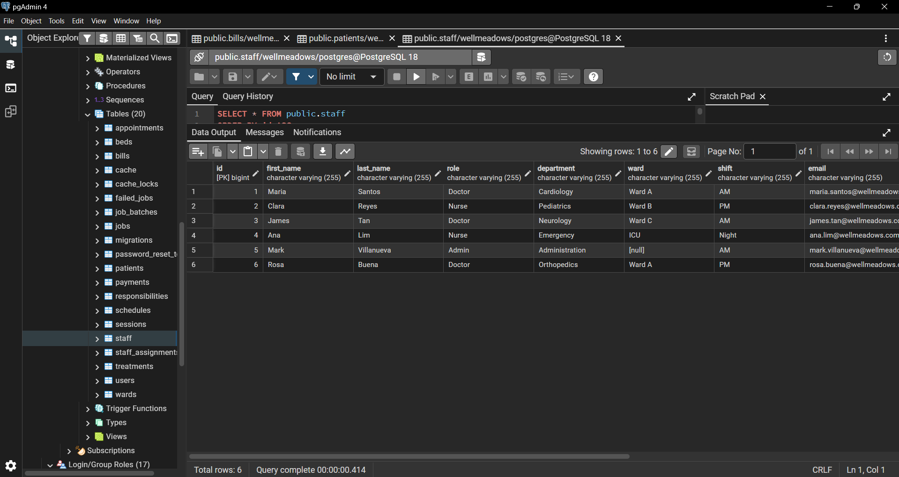

# WELLMEADOWS HOSPITAL MANAGEMENT SYSTEM

## Project Description

Si Owen na bahala sir

---

## Team Members

| Name | Module |
|---|---|
|TAN, SHADROCK| MODULE 1 |
|SALINAS, SHERLY| MODULE 2|
|BUHIAN, OWEN | MODULE 3|
|DE LA VICTORIA, CHARIE MAE| MODULE 4 |
|TURA, DOROTHY BLAINE| MODULE 5 |

---

## Tech Stack

- Laravel
- PHP
- PostgreSQL
- Railway
- Bootstrap/Tailwind

---

## Repository Link

(https://github.com/gitniuwin/wellmeadowsfinal.git)

---

## Setup Instructions

```bash
git clone https://github.com/gitniuwin/wellmeadowsfinal.git

composer install
npm install

cp .env.example .env

php artisan key:generate
```

---

## Environment Variables

Update `.env`

```env
DB_CONNECTION=pgsql
DB_HOST=127.0.0.1
DB_PORT=5432
DB_DATABASE=wellmeadows
DB_USERNAME=postgres
DB_PASSWORD=1234
```

---

## Run Migration

```bash
php artisan migrate
```

---

## Start Development Server

```bash
npm run dev
php artisan serve
```

---

## Default Login

Admin Account

```txt
email:director@wellmeadows.com
password:password123
```

---

## Database Information

### Database Platform

Railway PostgreSQL

### Main Tables

| Table | Purpose |
|---|---|
| users | authentication |
| products | inventory |
| sales | transactions |

---

## Module Assignment

| Module | Assigned Developer |
|---|---|
|MODULE 1 | SALINAS, SHERLY |
|MODULE 2 | TAN, SHADROCK|
|MODULE 3 | BUHIAN, OWEN|
|MODULE 4 | DE LA VICTORIA, CHARIE MAE|
|MODULE 5 | TURA, DOROTHY BLAINE|

---

## Deployment Information

### Live URL

```txt
https://wellmeadowsfinal-production.up.railway.app/login
```

### Hosting Platform

```txt
Railway
```

---

## Screenshots

Required screenshots:

Login Page


Dashboard


CRUD Module

- CREATE


- READ


- UPDATE


- DELETE


PostgreSQL Database Tables

